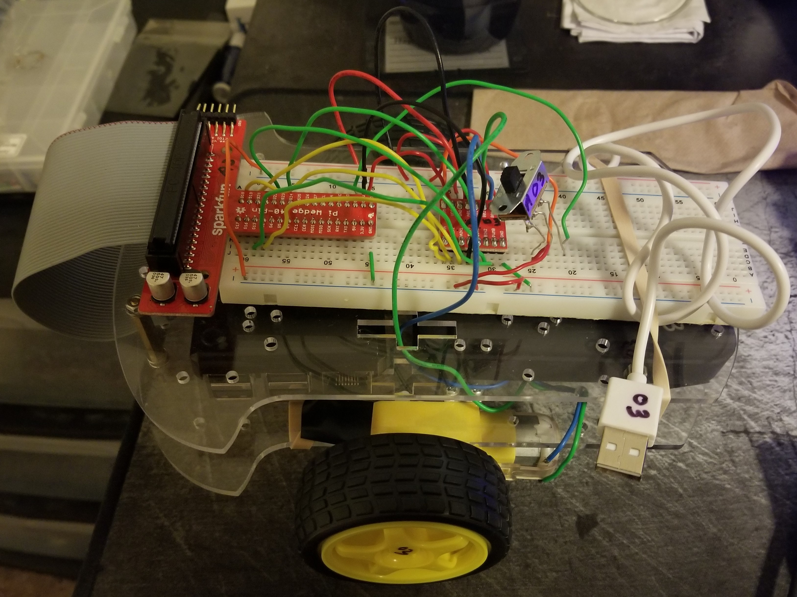

# Autonomus RC Card
 CMPEN 473 project to create an RC car that can move on its own

This project was done in C on a Raspberry pi 3. ALl the parts of the car were provided.
The goal of this project was to create a remote control car that could be controlled manually using keyboard inputs
and autonomously with the help of a camera. The car could switch between manual and autonomous with a keyboard input.
Other features include increasing and decreasing speed and providing runtime data.
Infared sensors were used previously to detect black lines on a white board.
A camera was added to replace the sensors to add more challenges and introduce image processing.
The program was multi-threaded in order to manage and work with all the componenets of the car.
The work that I did is located in the hw7feng.c file.

Photo of the WIP remote control car

